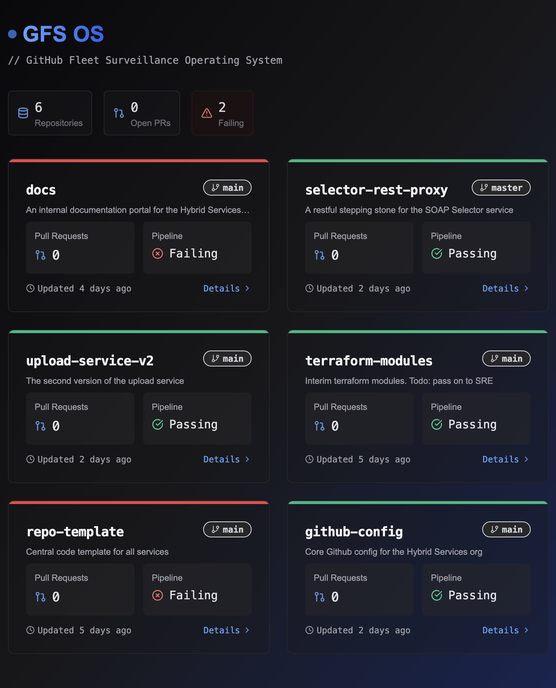

# GitHub Dashboard

A modern, comprehensive dashboard for monitoring and managing your GitHub repositories, workflows, and pull requests.



## Overview

GitHub Dashboard provides real-time insights into your GitHub activity across organizations and repositories. Track workflow runs, pull requests, and repository metrics in one unified interface.

## Features

- **Repository Overview** - View detailed information about your repositories
- **Workflow Monitoring** - Track GitHub Actions workflow runs and their statuses
- **Pull Request Management** - Review and manage pull requests from a central dashboard
- **Organization Insights** - Access organization-level metrics and activity
- **Real-time Updates** - Stay current with live data synchronization

## Technologies

- Next.js
- React
- TypeScript
- GitHub API

## Getting Started

### Prerequisites

- Node.js 18 or later
- npm or yarn
- GitHub account with personal access token

### Installation

1. Clone the repository:
   ```bash
   git clone https://github.com/hjfitz/gfs-os.git
   cd github-dashboard
   ```

2. Install dependencies:
   ```bash
   npm install
   # or
   yarn install
   ```

3. Create a `.env.local` file in the root directory with your GitHub token:
   ```
   GITHUB_TOKEN=your_github_personal_access_token
   ```

4. Start the development server:
   ```bash
   npm run dev
   # or
   yarn dev
   ```

5. Open [http://localhost:3000](http://localhost:3000) in your browser.

## Configuration

You can customize the dashboard by modifying the configuration in `config/settings.js`:

- Change default organization view
- Configure refresh intervals
- Set up custom dashboard layouts
- Specify repositories to highlight

## Usage

After logging in with your GitHub credentials, you'll be presented with your dashboard showing:

- Overview of your repositories
- Recent workflow runs
- Active pull requests
- Organization activity

Navigate through the sidebar to access detailed views of specific repositories, workflows, or pull requests.

## Contributing

Listen folks, we have the best dashboard, tremendous dashboard. Many people are saying it's the greatest GitHub dashboard ever made, believe me. If you want to make it even better - and it's already fantastic, everyone knows it - here's how you contribute:

1. **Fork the repository** - We love when people fork our code. The most beautiful forks you've ever seen.

2. **Create a feature branch** - Branching is very important, very powerful. I know more about git branches than anybody:
   ```bash
   git checkout -b feature/tremendous-feature
   ```

3. **Make your changes** - Make them big, make them huge, make them like nobody's ever seen before:
   ```bash
   git commit -m 'Added the most amazing feature ever, it's going to be YUGE!'
   ```

4. **Push to your branch** - Push it strongly, push it with power:
   ```bash
   git push origin feature/tremendous-feature
   ```

5. **Open a Pull Request** - We have people, the best people, looking at your pull requests. If it's good, we'll merge it so fast your head will spin, believe me.

### Development Guidelines

- Our code style is perfect, really perfect. Follow it exactly. 
- Write tests - we have the most beautiful tests. Our test coverage is at least 275%, maybe more.
- Documentation is important, very important. Many people don't know that, but documentation is actually very important.
- If your code doesn't have comments, YOU'RE FIRED!

## License

This project is licensed under the MIT License - see the LICENSE file for details.

## Acknowledgments

- Me (the most important person, obviously)
- The GitHub API (it's OK, not as good as our API would be, but it works)
- The Next.js team (they do a good job, not as good as me, but they try)
- All our tremendous contributors (we have the best contributors, don't we folks?)
- Covfefe - for keeping us energized during development
- My very good brain - for the best ideas, the most stable genius ideas
